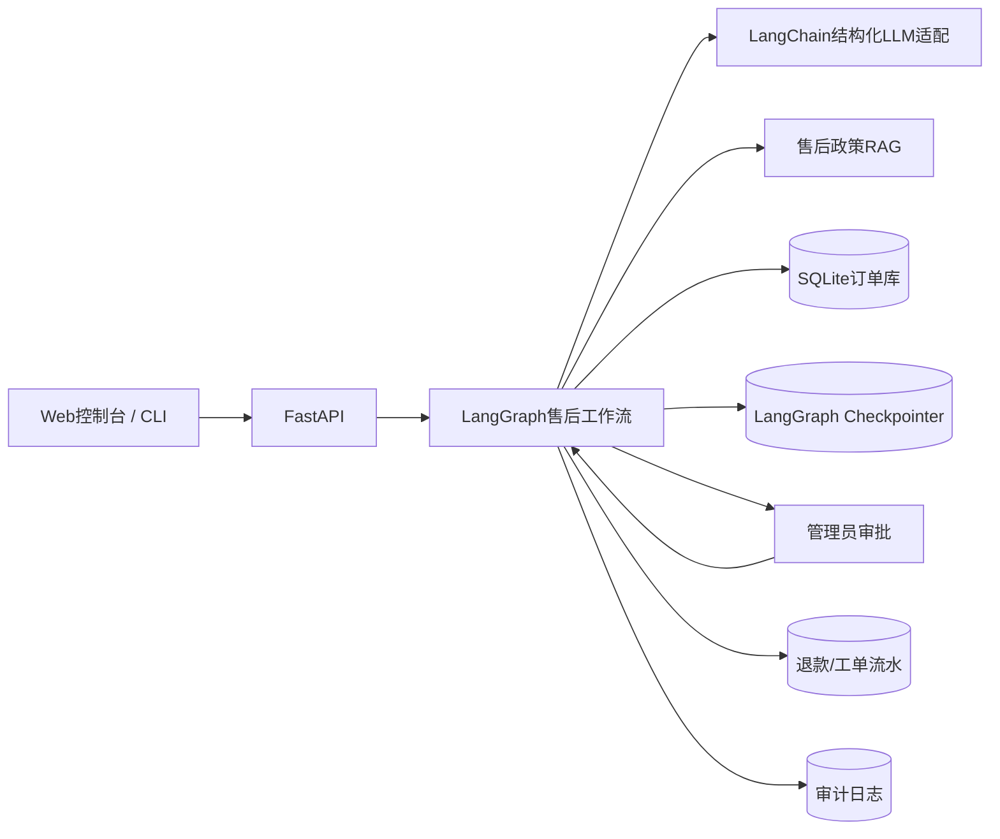
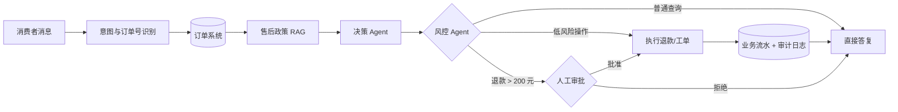
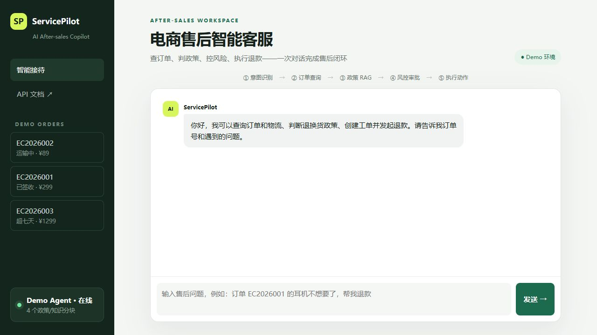
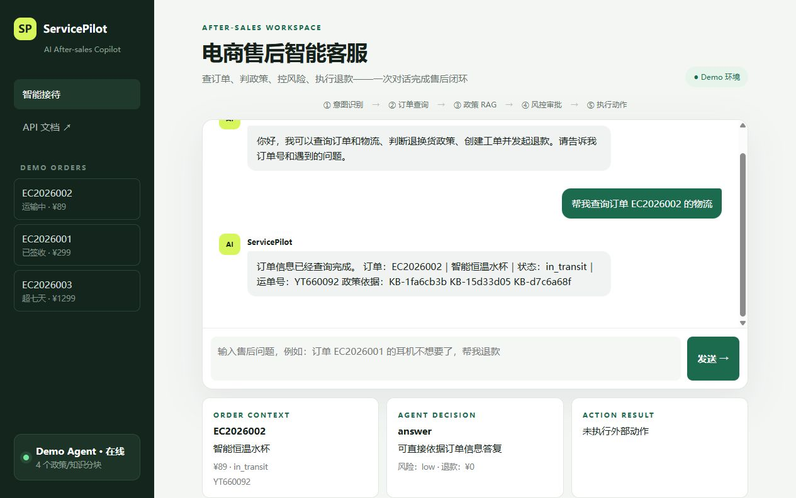
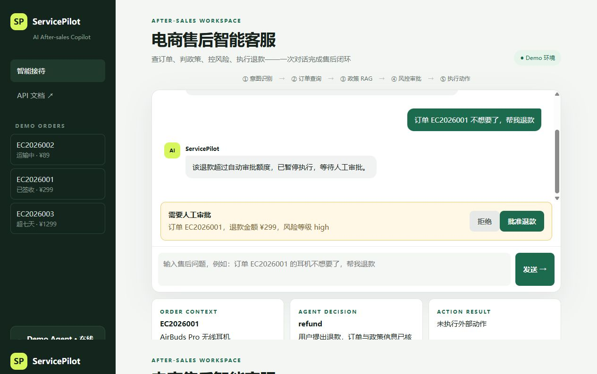
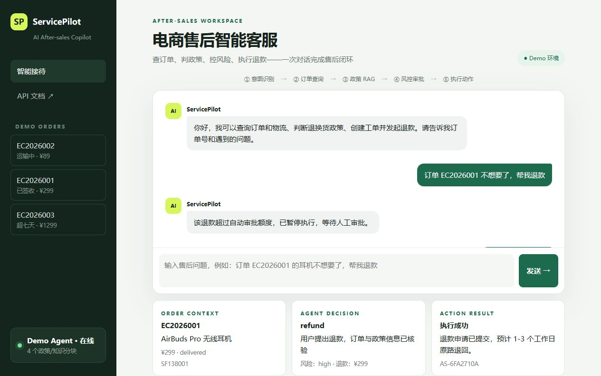
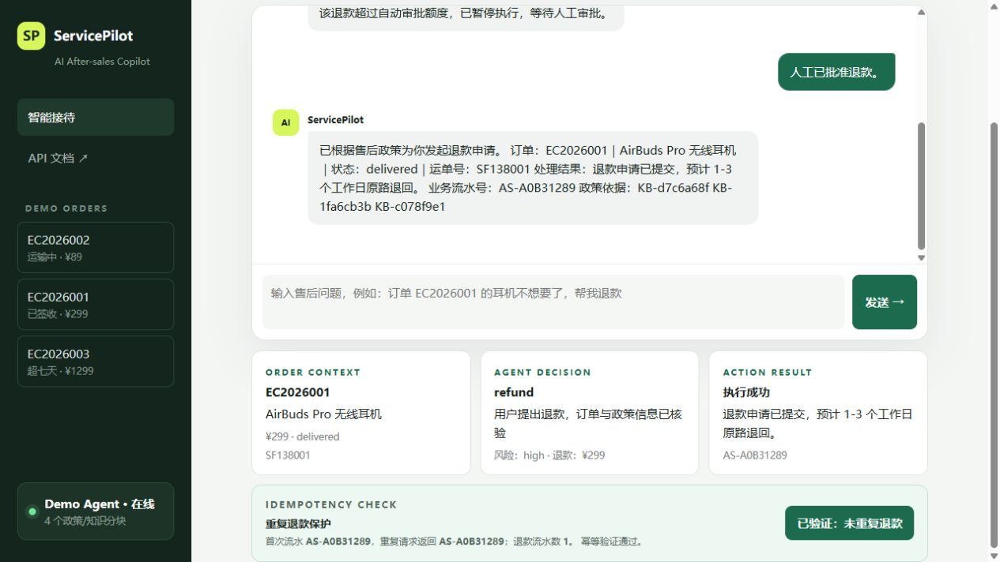

# ServicePilot：电商售后智能客服 Agent

> 一个真正有业务闭环的 LangChain / LangGraph 实习项目：用户提出售后问题后，Agent 会查询订单、检索政策、判断退款风险、请求人工审批，并真实写入退款或工单流水。


## 这不是“通用企业助手”

ServicePilot 服务于一个明确场景：**电商平台售后客服**。

用户是正在咨询订单的消费者和审核高风险退款的客服主管。输入是自然语言售后诉求，系统操作的是订单、物流、售后政策、退款和工单，输出不仅是聊天回复，还可能产生业务流水号、修改订单状态并写入审计日志。

### 可以处理的真实任务

- “订单 EC2026002 的快递到哪了？”→ 识别物流意图、查询订单并返回运单号。
- “订单 EC2026001 不想要了，帮我退款。”→ 检索七天无理由政策，发现退款 299 元超过自动额度，暂停并等待人工审批。
- 主管批准 → 从原状态恢复，提交退款、修改订单状态、返回业务流水号。
- “订单 EC2026003 的椅子损坏了，我要退货。”→ 识别已超过七天，自动创建人工售后工单，而不是违规直接退款。
- 重复提交同一操作 → 幂等键阻止重复退款。

## 系统架构



## 业务工作流



LangGraph 管理整个业务状态和路由；LangChain 负责模型适配与 Pydantic 结构化输出；SQLite 模拟订单、退款、工单与审计数据库；知识库 RAG 提供可引用的售后政策。

## 为什么适合大模型实习简历

项目同时覆盖了招聘中常见的四类能力：

- **Agent**：意图理解、工具选择、环境观察、动作执行。
- **LangGraph**：StateGraph、条件边、checkpointer、`interrupt` 和 `Command(resume)`。
- **RAG**：政策切块、持久化检索、证据 ID 和不可信内容隔离。
- **工程化**：FastAPI、幂等、审计、降级、安全护栏、Docker、CI 和自动化测试。

它与普通客服聊天机器人的区别是：模型不能随便承诺退款，所有决策必须结合真实订单与政策；高风险操作需要人工审批；执行动作可追踪、可恢复、不可重复。

## 项目界面与演示



物流查询会展示订单上下文和Agent决策，但不产生外部动作：



299元退款超过自动处理额度后，LangGraph暂停并等待人工审批；批准后从原thread恢复并生成业务流水：





重复提交同一`thread_id + action`时，系统返回第一次的业务流水号，不会写入第二条退款。可通过后文的一键演示在终端看到`same_reference: true`和`action_count: 1`。



## 5 分钟运行

```powershell
python -m venv .venv
.\.venv\Scripts\Activate.ps1
pip install -e ".[dev]"
Copy-Item .env.example .env
servicepilot serve
```

打开 <http://127.0.0.1:8000>。页面左侧提供三个演示订单，可直接测试物流查询、高金额退款审批和超期退货。

默认 `DEMO_MODE=true`，不消耗 API。切换自己的 OpenAI 兼容接口：

```dotenv
DEMO_MODE=false
LLM_API_KEY=你的密钥
LLM_BASE_URL=https://api.openai.com/v1
LLM_MODEL=gpt-4.1-mini
```

命令行测试普通查询：

```powershell
servicepilot chat "查询订单 EC2026002 的物流到哪了"
```

重复演示退款后可恢复虚构订单：`servicepilot reset-demo`。

### Docker启动

```powershell
Copy-Item .env.example .env
docker compose up --build
```

然后访问 <http://127.0.0.1:8000>。演示模式无需API Key；若连接真实兼容接口，只修改本地`.env`，不要提交该文件。

## 核心 API

```text
POST /v1/support/chat                 发起售后对话
POST /v1/support/{thread_id}/resume   批准或拒绝高风险操作
GET  /v1/support/orders/{order_id}    查询订单系统
GET  /v1/support/actions              查看退款/工单业务流水
POST /v1/knowledge/text               导入新的售后政策
```

第一次请求：

```bash
curl -X POST http://127.0.0.1:8000/v1/support/chat \
  -H "Content-Type: application/json" \
  -d '{"message":"订单 EC2026001 不想要了，帮我退款"}'
```

响应为 `needs_approval` 时，使用返回的 `thread_id` 恢复：

```bash
curl -X POST http://127.0.0.1:8000/v1/support/<thread_id>/resume \
  -H "Content-Type: application/json" \
  -d '{"approved":true,"feedback":"主管核验通过"}'
```

示例响应（字段已缩短）：

```json
{
  "thread_id": "support-...",
  "status": "needs_approval",
  "answer": "退款金额299元，等待主管审批。",
  "pending_action": {"action": "refund", "amount": 299.0}
}
```

## 关键代码

```text
src/insightforge/support/
├── graph.py       # 售后 LangGraph、条件路由、HITL
├── models.py      # 意图、订单、决策、风控结构化模型
├── prompts.py     # 意图、决策、风控角色约束
├── state.py       # 售后任务共享状态
└── store.py       # 订单工具、退款/工单执行、幂等与审计
```

通用深度研究工作流仍保留在 `src/insightforge/agents`，可作为对比学习材料；项目主应用已经切换为售后客服。

## 测试

```powershell
ruff check .
ruff format --check .
pytest --cov=insightforge --cov-report=term-missing
```

测试不调用真实模型，覆盖订单查询、缺少订单号、高金额退款审批、拒绝后不执行、超期退货转工单、幂等、安全护栏与 API。

### 一键验收与可重复演示

项目提供了一个不依赖外部 API 的验收脚本。它会依次运行 17 项测试、Ruff 代码检查，随后真实调用 FastAPI 应用完成“物流查询 → 高金额退款暂停 → 人工批准 → 恢复执行 → 查看业务流水”的完整演示：

```powershell
powershell -ExecutionPolicy Bypass -File scripts\verify_support.ps1
```

也可以只运行三段业务演示：

```powershell
.venv\Scripts\python scripts\demo_support.py
```

演示订单日期按运行当天相对生成，高金额退款与超期退货场景不会再因为固定日期老化而失效；自动化测试使用可注入的固定时钟，确保结果可重复。

## 数据集、实验与消融

当前使用3条虚构订单、虚构售后政策和17项自动化回归用例，不包含真实用户或支付数据。

| 验证项 | 结果 | 说明 |
|---|---:|---|
| 自动化测试 | 17/17通过 | 不调用外部模型 |
| 高金额退款 | 进入审批 | 299元超过200元自动额度 |
| 审批恢复 | 产生1条流水 | 从同一LangGraph thread恢复 |
| 重复退款 | 仍为1条流水 | 返回原reference_id，幂等命中 |

数据定义见[数据集说明](docs/DATASET.md)，实验边界与后续消融见[实验与消融说明](docs/EVALUATION.md)。这里不把功能测试通过率包装成模型准确率。

## 已知问题与后续计划

1. 接入真实 MySQL 订单库，并把数据库查询包装成只读 Tool。
2. 加入多轮对话，从历史消息补全订单号和用户诉求。
3. 用 embedding + reranker 替换学习版关键词检索。
4. 建立售后评测集，统计意图准确率、政策引用正确率、违规退款率和人工转接率。
5. 增加用户鉴权：只能查询当前用户自己的订单。
6. 接入消息队列和支付沙箱，异步处理真实退款回调。

当前退款执行器是教学用本地事务，不连接支付平台；政策检索是轻量持久化检索；多用户鉴权、并发退款锁和生产可观测性仍待实现。

详见 [学习指南](docs/LEARNING_GUIDE.md) 与 [面试指南](docs/INTERVIEW.md)。

完整的投递材料还包括[售后智办完整面试教程](docs/售后智办_完整面试教程.md)、[207道逐题问答](docs/售后智办_面试问题与标准回答.md)和[两个项目的投递验收报告](docs/项目投递验收报告.md)。

## License

MIT。演示订单和政策均为虚构数据。
