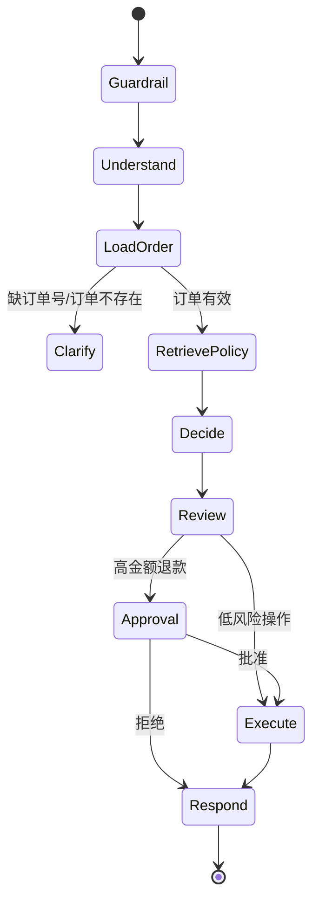

# ServicePilot 架构与业务决策

## 业务边界

ServicePilot 只处理电商售后，不负责推荐商品、营销或支付。它读取演示订单和售后政策，可以查询物流、创建工单、提交退款；退款超过 200 元时必须由人工批准。

明确边界非常重要：一个能调用所有工具的“万能 Agent”既难评测，也容易越权。

## 状态如何流转

`SupportState` 是节点之间唯一的共享协议：原始消息经过护栏后，由意图节点生成 `IntentResult`；订单节点只读取数据库；政策节点返回证据；决策节点生成 `ServiceDecision`；风控节点生成 `ResponseReview`；最终只有执行节点可以写业务数据库。

## 为什么 LLM 不能直接操作数据库

模型只输出经过 Pydantic 校验的动作建议。代码再执行金额上限、七天时限和审批规则，最后调用 `CommerceStore.execute`。这样把概率性的语言理解和确定性的业务约束分开。

## 幂等与审计

执行动作使用 `thread_id + action` 作为幂等键。同一个任务即使因网络重试再次提交，也只产生一条退款或工单记录。每次写操作同步记录审计事件。这两个细节比“用了几个 Agent”更接近真实生产系统。

## 人工审批为什么依赖 Checkpointer

高金额退款调用 `interrupt()` 后，进程需要保存订单、政策证据、决策和风控结果。主管批准时，`Command(resume=...)` 使用相同 `thread_id` 从暂停点继续，而不是重新让模型决策。

学习版使用 `InMemorySaver`；多实例生产环境应替换为 Postgres checkpointer，并加入审批超时与补偿任务。

## 生产升级

- 订单工具增加用户身份与订单归属校验。
- 退款调用支付沙箱，通过消息队列接收异步回调。
- 政策检索升级为 BM25 + vector + reranker。
- 对模型与工具分别采集延迟、token、错误率和操作成功率。
- 建立违规退款率、意图准确率、引用正确率等离线评测指标。

